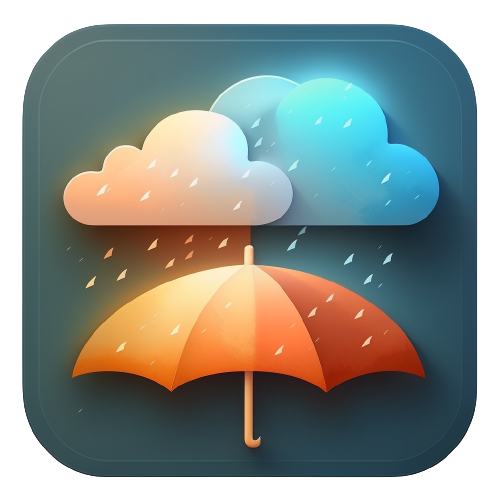
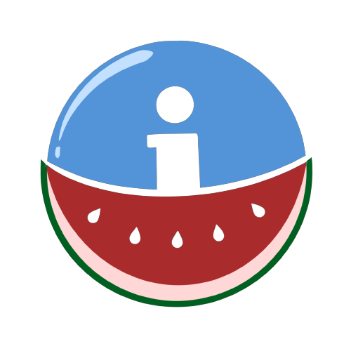

### Hola, Soy Juan Carlos y...

<!--
**JuankaEsMa/JuankaEsMa** is a ✨ _special_ ✨ repository because its `README.md` (this file) appears on your GitHub profile.

Here are some ideas to get you started:

- 🔭 I’m currently working on ...
- 🌱 I’m currently learning ...
- 👯 I’m looking to collaborate on ...
- 🤔 I’m looking for help with ...
- 💬 Ask me about ...
- 📫 How to reach me: ...
- 😄 Pronouns: ...
- ⚡ Fun fact: ...
-->
## He trabajado en distintos proyectos 

# Léeme Esta 

Un chat que usa Firebase que simplemente deja manda mensajes si contiene un insulto en el Mensaje 

 

# ToDoList 

Una aplicación que te deja crear listas y tareas a tu gusto. 

 

# Weather App

Una aplicación que te da el tiempo y la temperatura de hoy a 3 días

# Food Scanner App

Una aplicación que te deja buscar alimentos, escanearlos (con el código EAN13) y
apuntar tus alímentos y tener un historial de productos tanto buscados como escaneados

